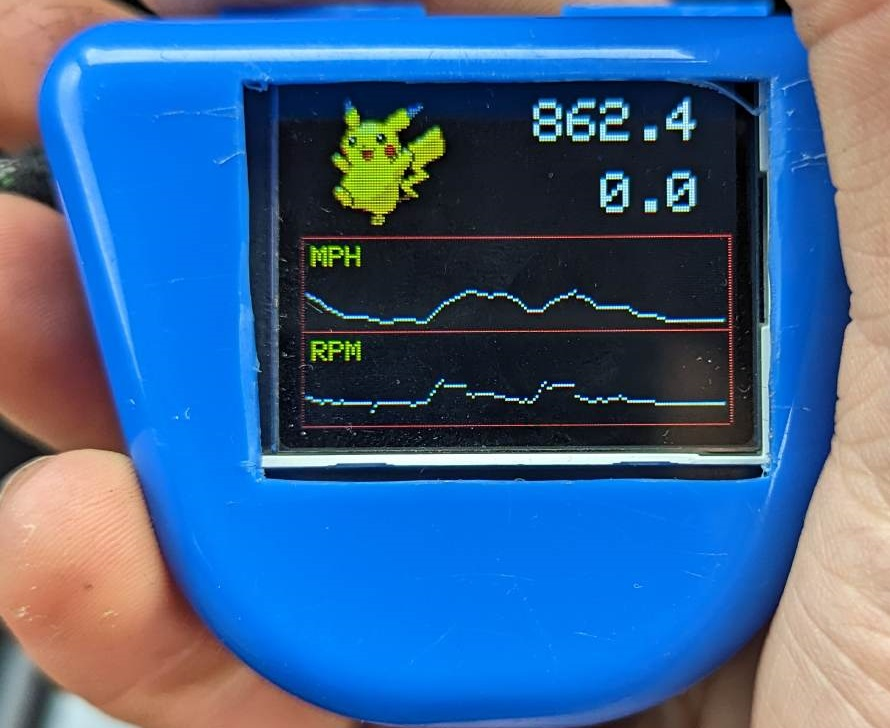

# Speedometer Project

*example of the finished (for now) product*

This project is a speedometer with a wee tft display, for my suzuki jimny.

## Hardware 

### Controller
   * Raspberry pi pico
   * It connects to the radio for 12v power (converted to 5v to power pico).
   * It takes 2 lines from the back of the ECU which are used to read engine speed and vehicle speed. These inputs are digital signals from the ECU, not raw signals from the sensors.

### Speedometer Input
   * brown 20 gauge wire from back of ECU
   * simple 12v digital signal, a series of pulses whose frequency matches the speed of the vehicle (1hz==1mph)
   * connected via 200k resistor to input pin on pico, then grounded via 68k resistor. This means that the signal is grounded with a resistance of 268k, and the input pin recieves ~3.3v. This isn't ideal but doesn't stop the other components in the vehicle from reading the signal correctly.

### Tachometer Input
   * green/yellow 20 gauge wire from back of ECU
   * simple 12v digital signal, a series of pulses whose frequency matches the speed of the engine (1hz==1 revolution of engine, so 16.67hz==1000rpm)
   * connected via 200k resistor to input pin on pico, then grounded via 68k resistor. This means that the signal is grounded with a resistance of 268k, and the input pin recieves ~3.3v. This isn't ideal but doesn't stop the other components in the vehicle from reading the signal correctly.

### Display
   * a waveshare chinese special 2 inch display, resolution 160x128. 
	 * has the st7735 micro controller on it, which the pico interfaces with via SPI at 2 Mhz.
	 * my program uses a library I found on the internet made by adafruit for connecting to st77xx devices.

### Pins
   * pin 39 -- 5V input
   * pin 38 -- ground output, 68k resistor going to pin 34 
   * pin 34 -- gp28 -- reading voltage, 68k resistor going to pin 38, 200k resistor going to signal input for speedometer
   * pin 31 -- gp26 -- reading voltage, 68k resistor going to pin 28, 200k resistor going to signal input for tachometer
   * pin 28 -- ground, 68k resistor going to pin 31
   * pin 11 -- gp8 -- data/command for display (not used)
   * pin 12 -- gp9 -- SPI slave select for display 
   * pin 14 -- gp10 -- SPI clock for display
   * pin 15 -- gp11 -- SPI data for sending to display
   * pin 16 -- gp12 -- reset button for display (not used)
   * pin 17 -- gp13 -- display backlight (output pwm for adjusting brightness)
